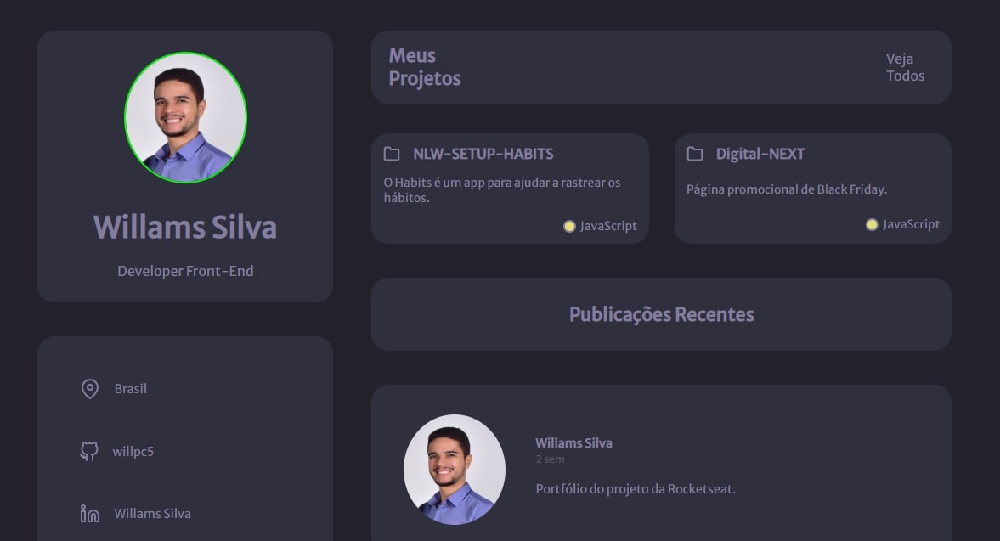

<h1 align="center"> Portfolio </h1>

Meu Portifolio como Programador  

  <a href="#-tecnologias">Tecnologias</a>&nbsp;&nbsp;&nbsp;|&nbsp;&nbsp;&nbsp;
  <a href="#-projeto">Projeto</a>&nbsp;&nbsp;&nbsp;|&nbsp;&nbsp;&nbsp;

 

  

## 🚀 Tecnologias

Esse projeto foi desenvolvido com as seguintes tecnologias:

- HTML e CSS
- Git e Github
- Figma

## 💻 Projeto

Projeto Portfolio Para Desenvolvedor.

- [Visite o projeto online]()

---

Feito com ♥ by WillamsSilva